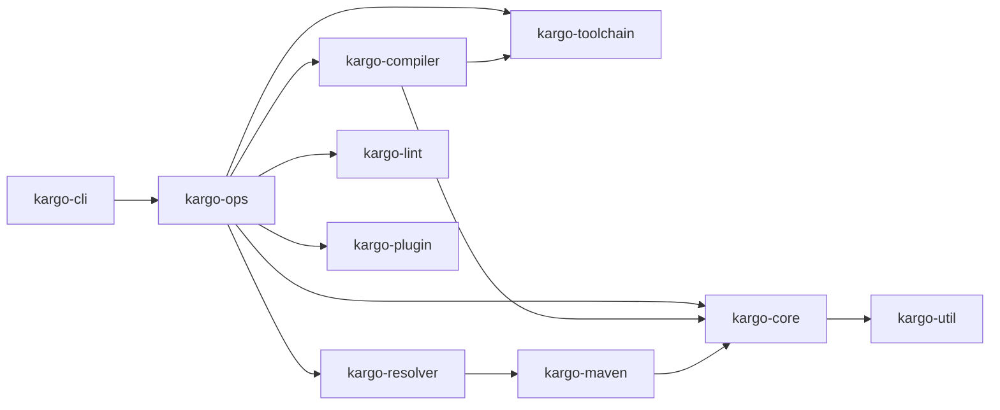

# Kargo

A fast, modern build and dependency management tool for Kotlin, written in Rust.

Inspired by [Cargo](https://doc.rust-lang.org/cargo/), Kargo replaces Gradle's complexity with a single declarative `Kargo.toml` manifest while staying fully compatible with the Maven ecosystem.

> **Status:** Phase 1 complete (project scaffolding, core types, CLI). Not yet usable for real builds — see [Roadmap](#roadmap).

---

## Why Kargo?

| | Gradle | Kargo |
|---|--------|-------|
| **Config** | Groovy/Kotlin DSL scripts | Declarative TOML |
| **Speed** | JVM startup + Groovy compilation | Native Rust binary |
| **Learning curve** | Steep (task graph, DSL, plugins) | Minimal (Cargo-like UX) |
| **Deps** | Maven Central via custom protocol | Maven Central via standard protocol |
| **KMP** | First-class | First-class |
| **Compose** | Plugin-based | Built-in |

---

## Quick Start

### Build from Source

```bash
git clone https://github.com/dejanradmanovic/kargo.git
cd kargo
cargo install --path crates/kargo-cli
```

### Create a Project

```bash
kargo new my-app
cd my-app
```

This generates:

```
my-app/
├── Kargo.toml          # Project manifest
├── Kargo.lock          # Dependency lockfile
├── .gitignore
├── .kargo.env          # Build secrets (gitignored)
└── src/
    ├── main/kotlin/Main.kt
    └── test/kotlin/
```

### Templates

```bash
kargo new my-app                       # JVM application (default)
kargo new my-lib --template lib        # JVM library
kargo new my-kmp --template kmp        # Kotlin Multiplatform (JVM + iOS)
kargo new my-cmp --template cmp        # Compose Multiplatform (JVM + Android + iOS + Desktop)
kargo new my-droid --template android  # Android-only
```

Use `kargo init` to add Kargo to an existing project without generating source files.

---

## Kargo.toml

### JVM Application

```toml
[package]
name = "my-app"
version = "0.1.0"
kotlin = "2.3.0"

[targets.jvm]
java-target = "21"

[dependencies]
kotlinx-coroutines = "org.jetbrains.kotlinx:kotlinx-coroutines-core:1.8.0"

[dev-dependencies]
kotlin-test = "org.jetbrains.kotlin:kotlin-test:2.3.0"
```

### Compose Multiplatform

```toml
[package]
name = "my-cmp-app"
version = "0.1.0"
kotlin = "2.3.0"

[targets]
jvm = { java-target = "21" }
android = { min-sdk = 24, target-sdk = 35, compile-sdk = 35 }
ios-arm64 = {}
ios-simulator-arm64 = {}

[compose]
enabled = true

[dependencies]
kotlinx-coroutines = "org.jetbrains.kotlinx:kotlinx-coroutines-core:1.8.0"
```

### Build Flavors

```toml
[flavors]
dimensions = ["tier", "environment"]

[flavors.tier.free]
build-config = { IS_PAID = "false" }

[flavors.tier.paid]
build-config = { IS_PAID = "true" }

[flavors.environment.staging]
build-config = { API_URL = "https://staging.api.example.com" }

[flavors.environment.production]
build-config = { API_URL = "https://api.example.com" }
```

---

## Commands

### Building

```bash
kargo build                      # Build project
kargo build --release            # Release profile
kargo build --target jvm         # Specific target
kargo build --variant paid-prod  # Specific flavor variant
kargo run                        # Build and run
kargo check                      # Type-check only
kargo clean                      # Remove build artifacts
```

### Dependencies

```bash
kargo add org.jetbrains.kotlinx:kotlinx-coroutines-core:1.8.0
kargo remove kotlinx-coroutines
kargo update                     # Update to latest compatible
kargo tree                       # Dependency tree
kargo tree --why some-dep        # Why is this included?
kargo outdated                   # Show available updates
kargo audit                      # Vulnerability scan (OSV)
```

### Code Quality

```bash
kargo lint                       # Run linter
kargo lint --fix                 # Auto-fix
kargo fmt                        # Format code
kargo fmt --check                # Check formatting (CI)
kargo test                       # Run tests
kargo test --coverage            # With coverage
```

### Toolchain

```bash
kargo toolchain install 2.3.0    # Install Kotlin version
kargo toolchain list             # List installed
kargo toolchain use 2.3.0        # Set default
```

### Environment & Secrets

```bash
kargo env                        # Show .kargo.env (masked)
kargo env --reveal               # Show values
```

`.kargo.env` holds secrets needed to build (registry credentials, signing passwords). Reference them in `Kargo.toml` via `${env:VAR}`:

```toml
[repositories]
private = { url = "https://nexus.company.com/maven", username = "${env:NEXUS_USER}", password = "${env:NEXUS_PASS}" }
```

### Publishing & Packaging

```bash
kargo publish                    # Publish to Maven
kargo package                    # Create distributable
kargo package --docker           # Docker image
kargo package --ios-universal    # XCFramework
```

### More

```bash
kargo doctor                     # Diagnose project health
kargo migrate                    # Migrate from Gradle
kargo watch                      # Rebuild on changes
kargo repl                       # Kotlin REPL
kargo metadata --format json     # Machine-readable project info
```

---

## Architecture

Kargo is a Rust workspace with 10 crates:

```
kargo-cli          CLI binary (clap)
kargo-ops          High-level operations (build, test, publish)
kargo-core         Manifest, targets, flavors, templates, lockfile
kargo-resolver     Dependency resolution (Maven-compatible)
kargo-maven        Maven protocol (POM, metadata, download, publish)
kargo-compiler     Kotlin compiler orchestration (kotlinc, Compose, KSP)
kargo-plugin       Plugin system (subcommands, Rhai scripting)
kargo-lint         Linter + formatter (tree-sitter-kotlin)
kargo-toolchain    Kotlin/JDK/SDK auto-download and management
kargo-util         Shared utilities (errors, FS, hashing, process)
```



---

## Roadmap

| Phase | Scope | Status  |
|-------|-------|---------|
| 1. Foundation | Core types, manifest parsing, CLI scaffold, templates, `new`/`init`/`clean`/`env` | Done    |
| 2. Toolchain | Kotlin compiler auto-download, JDK/SDK discovery | Done    |
| 3. Maven + Resolution | POM parsing, dependency resolution, lockfile, `add`/`tree`/`outdated` | Done    |
| 4. Compilation | kotlinc invocation, incremental builds, build cache | Planned |
| 5. KMP + CMP + Flavors | Multi-target builds, Compose plugin, source set hierarchy, flavors | Planned |
| 6. Code Quality | Linter, formatter, test coverage, benchmarks | Planned |
| 7. Plugins + Hooks | Subcommand plugins, Rhai scripting, hook lifecycle | Planned |
| 8. Packaging | Fat JAR, Docker, XCFramework, signing | Planned |
| 9. Security | `kargo audit` (OSV), offline mode, dependency insights | Planned |
| 10. IDE + DX | `kargo metadata`, LSP, `kargo doctor`, `kargo migrate`, shell completions | Planned |

---

## Documentation

- **[Architecture](docs/ARCHITECTURE.md)** — Design decisions, crate structure, data models, implementation phases
- **[User Guide](docs/USER_GUIDE.md)** — Full configuration reference, command usage, examples
- **[Contributing](docs/CONTRIBUTING.md)** — Development setup, coding conventions, PR workflow

---

## Development

### Prerequisites

- Rust 1.80+
- Cargo

### Build & Test

```bash
cargo build              # Build all crates
cargo test               # Run all tests (141 tests)
cargo run -- new my-app  # Test the CLI
```

### Project Conventions

- `miette` + `thiserror` for errors — no `unwrap()` in library code
- `BTreeMap` for deterministic ordering
- Tests in dedicated `tests/` directories (integration-style)
- Conventional commits (`feat:`, `fix:`, `refactor:`, scoped by crate)

---

## License

Dual-licensed under [MIT](LICENSE-MIT) or [Apache-2.0](LICENSE-APACHE), at your option.
