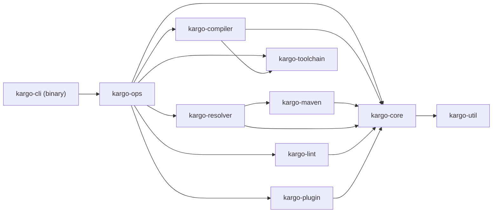
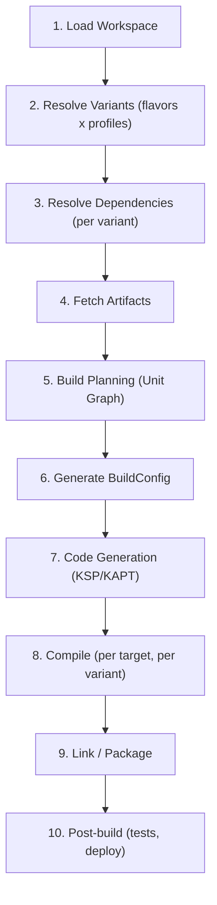
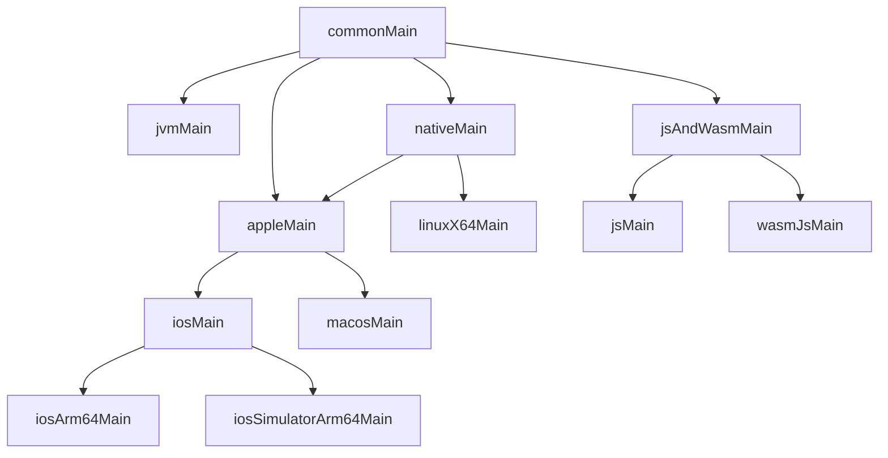

# Kargo: A Cargo-Inspired Build Tool for Kotlin

## 1. High-Level Architecture

Kargo is structured as a Rust workspace with multiple crates, mirroring Cargo's layered design: a thin CLI binary delegates to a library of operations, which in turn depend on core data structures, a dependency resolver, Maven protocol support, compiler orchestration, a plugin system, and lint/format engines.



---

## 2. Rust Workspace Crate Structure

```
kargo/
  Cargo.toml                          # Rust workspace root
  crates/
    kargo-cli/                        # Binary entry point, CLI parsing (clap)
    kargo-ops/                        # High-level operations (build, test, publish, etc.)
    kargo-core/                       # Core types: Manifest, Package, Workspace, Target, SourceSet, Dependency, Lockfile, Profile, Config
    kargo-resolver/                   # Dependency resolution algorithm (Maven-compatible, "nearest wins")
    kargo-maven/                      # Maven repo protocol: POM parsing, metadata.xml, artifact download, checksum, auth, publish, local cache
    kargo-compiler/                   # Kotlin compiler orchestration: kotlinc/kotlinc-js/kotlinc-native invocation, Compose plugin, KSP/KAPT, incremental builds, unit graph, job queue
    kargo-plugin/                     # Plugin system: subcommand discovery, embedded scripting (Rhai), WASM extensions (future), hook dispatch
    kargo-lint/                       # Lint engine + built-in rules, code formatter (Kotlin official style), auto-fix
    kargo-toolchain/                  # Kotlin toolchain management: auto-download, version switching, SDK discovery (Xcode, Android SDK)
    kargo-util/                       # Shared: FS ops, process spawning, hashing (SHA-1/256), TOML helpers, error types, progress UI, diagnostics
  docs/                               # Architecture docs, user guide, contributor guide
  tests/                              # Integration tests
  benches/                            # Benchmarks
  .cursor/rules/                      # AI assistant rules
```

---

## 3. Configuration Format: `Kargo.toml`

TOML-based, inspired by Cargo.toml but adapted for Kotlin's ecosystem. Parsed via `toml` and `toml_edit` (for format-preserving edits by `kargo add`/`kargo remove`).

### 3.1 Single-target (JVM) example

```toml
[package]
name = "my-app"
version = "0.1.0"
kotlin = "2.3.0"
description = "My Kotlin application"
authors = ["Jane Doe <jane@example.com>"]
license = "Apache-2.0"
repository = "https://github.com/user/my-app"

[targets.jvm]
java-target = "21"

[dependencies]
kotlinx-coroutines = "org.jetbrains.kotlinx:kotlinx-coroutines-core:1.8.0"
kotlinx-serialization = "org.jetbrains.kotlinx:kotlinx-serialization-json:1.6.0"

[dev-dependencies]
kotlin-test = "org.jetbrains.kotlin:kotlin-test:2.3.0"

[plugins]
serialization = "org.jetbrains.kotlin.plugin.serialization"

[lint]
rules = ["naming", "style", "complexity"]
severity = "warning"

[format]
style = "official"
indent = 4
max-line-length = 120

[profile.dev]
debug = true

[profile.release]
optimization = true
```

### 3.2 Compose Multiplatform (CMP) example

```toml
[package]
name = "my-cmp-app"
version = "0.1.0"
kotlin = "2.3.0"

[targets]
jvm = { java-target = "21" }
android = { min-sdk = 24, target-sdk = 35, compile-sdk = 35 }
ios-arm64 = {}
ios-simulator-arm64 = {}
js = { module-kind = "es" }
wasm-js = {}

[compose]
enabled = true

[dependencies]
kotlinx-coroutines = "org.jetbrains.kotlinx:kotlinx-coroutines-core:1.8.0"

[target.jvm.dependencies]
ktor-server = "io.ktor:ktor-server-core:2.3.0"

[target.ios.dependencies]
# iOS-specific deps

[dev-dependencies]
kotlin-test = "org.jetbrains.kotlin:kotlin-test:2.3.0"

[hooks]
pre-build = ["fmt --check", "lint"]
post-build = []
post-test = ["coverage-report"]

[workspace]
members = ["app", "shared", "libs/*"]
```

### 3.3 Lockfile: `Kargo.lock`

Deterministic, human-readable lockfile recording exact resolved versions, checksums, and source for every transitive dependency. Format similar to Cargo.lock:

```toml
[[package]]
name = "kotlinx-coroutines-core"
group = "org.jetbrains.kotlinx"
version = "1.8.0"
checksum = "sha256:abc123..."
source = "https://repo.maven.apache.org/maven2"

[[package.dependencies]]
name = "kotlin-stdlib"
group = "org.jetbrains.kotlin"
version = "2.3.0"
```

---

## 4. Build Flavors and Variants

Build flavors let you produce multiple variants of an application from the same codebase -- different API endpoints, free vs paid feature sets, white-label branding, etc. This is inspired by Android Gradle Plugin's `productFlavors` but generalized for all Kotlin targets.

### 4.1 Concepts

- **Flavor dimension** -- an independent axis of variation (e.g., `tier`, `environment`, `brand`)
- **Flavor** -- a named value within a dimension (e.g., `free`/`paid` in the `tier` dimension)
- **Profile** -- build optimization level (`dev`, `release`, or custom)
- **Build variant** -- the full cross-product: one flavor per dimension + one profile. For dimensions `[tier, env]` with flavors `[free, paid]` x `[staging, prod]` and profiles `[dev, release]`, the variants are: `freeStagingDev`, `freeStagingRelease`, `freeProdDev`, `freeProdRelease`, `paidStagingDev`, `paidStagingRelease`, `paidProdDev`, `paidProdRelease`

### 4.2 Kargo.toml Configuration

```toml
[package]
name = "my-app"
version = "1.0.0"
kotlin = "2.3.0"

[targets.jvm]
java-target = "21"

# Define flavor dimensions (order matters for variant naming)
[flavors]
dimensions = ["tier", "environment"]

# Flavors within each dimension
[flavors.tier.free]
build-config = { IS_PAID = "false", AD_SUPPORTED = "true" }
application-id-suffix = ".free"

[flavors.tier.paid]
build-config = { IS_PAID = "true", AD_SUPPORTED = "false" }
application-id-suffix = ".paid"

[flavors.environment.staging]
build-config = { API_URL = "https://staging.api.example.com", LOG_LEVEL = "DEBUG" }
application-id-suffix = ".staging"

[flavors.environment.production]
build-config = { API_URL = "https://api.example.com", LOG_LEVEL = "ERROR" }

# Common dependencies
[dependencies]
kotlinx-coroutines = "org.jetbrains.kotlinx:kotlinx-coroutines-core:1.8.0"

# Flavor-specific dependencies
[flavor.free.dependencies]
ad-sdk = "com.example:ad-sdk:2.0.0"

[flavor.paid.dependencies]
premium-features = "com.example:premium:1.0.0"

[flavor.staging.dependencies]
leak-canary = "com.squareup.leakcanary:leakcanary-android:2.12"

# Flavor-specific resources override common resources
# Flavor-specific signing
[flavors.tier.paid.signing]
keystore = "release.keystore"
key-alias = "paid-release"
store-password-cmd = "op read 'op://Dev/Keystore/password'"
```

### 4.3 Flavor Source Sets

Each flavor gets its own optional source directory. Sources are merged in order: common -> dimension flavor -> variant. Later sources can override or extend earlier ones.

```
src/
  commonMain/kotlin/           # All variants
  commonMain/resources/
  freeMain/kotlin/             # Free-tier only sources
  freeMain/resources/          # Free-tier only resources (e.g., different app icon)
  paidMain/kotlin/             # Paid-tier only sources
  paidMain/resources/
  stagingMain/kotlin/          # Staging-env only sources
  productionMain/kotlin/       # Production-env only sources
  freeStagingMain/kotlin/      # Specific variant combination (optional, rare)
```

### 4.4 Build Config Generation

Kargo generates a `BuildConfig` object available at compile time with typed constants:

```kotlin
// Auto-generated by Kargo based on [flavors.*.build-config] + [profile]
object BuildConfig {
    const val IS_PAID: String = "true"
    const val AD_SUPPORTED: String = "false"
    const val API_URL: String = "https://api.example.com"
    const val LOG_LEVEL: String = "ERROR"
    const val BUILD_TYPE: String = "release"    // from profile
    const val VERSION_NAME: String = "1.0.0"    // from [package]
    const val VERSION_CODE: Int = 1
    const val DEBUG: Boolean = false             // from profile
}
```

### 4.5 CLI Integration

Flavors integrate with build commands via `--flavor` and `--variant` flags:

```bash
# Build a specific variant
kargo build --variant freeStagingDev

# Build all variants of a specific flavor
kargo build --flavor paid

# Build all variants
kargo build --all-variants

# Run a specific variant
kargo run --variant paidProductionRelease

# Test a specific flavor
kargo test --flavor free

# List all defined variants
kargo variant list
```

### 4.6 Variant-Aware Dependency Resolution

Each variant can have a different dependency graph. Kargo resolves dependencies per-variant:

- Common deps apply to all variants
- Flavor deps are merged per variant (e.g., `freeStagingDev` gets `[dependencies]` + `[flavor.free.dependencies]` + `[flavor.staging.dependencies]` + `[dev-dependencies]`)
- Conflicts between flavor deps in different dimensions are reported as errors

### 4.7 Variant Filtering

For large flavor matrices, you can exclude impossible or unwanted combinations:

```toml
[flavors]
dimensions = ["tier", "environment"]
exclude = [
    { tier = "free", environment = "production" },  # free tier has no production build
]
```

### 4.8 Default Variant

```toml
[flavors]
dimensions = ["tier", "environment"]
default = { tier = "paid", environment = "staging" }  # used when no --variant is specified
```

When no flavors are defined, the project has a single implicit variant per profile (just `dev` and `release`), matching the behavior of a project without flavors.

---

## 5. Project Layout Convention

### JVM-only

```
my-project/
  Kargo.toml
  Kargo.lock
  .kargo.env                 # Build secrets and credentials (gitignored)
  src/
    main/kotlin/             # Main sources
    main/resources/          # Resources
    test/kotlin/             # Test sources
    test/resources/
  build/                     # Output (gitignored)
```

### JVM with Flavors

```
my-flavored-app/
  Kargo.toml
  Kargo.lock
  src/
    main/kotlin/              # Common to all variants
    main/resources/
    test/kotlin/
    freeMain/kotlin/           # Free-tier sources
    freeMain/resources/        # Free-tier resources (e.g., different icons)
    paidMain/kotlin/           # Paid-tier sources
    paidMain/resources/
    stagingMain/kotlin/        # Staging env sources
    productionMain/kotlin/     # Production env sources
  build/
    variants/
      freeStagingDev/          # Per-variant output
      paidProductionRelease/
```

### Multiplatform

```
my-kmp-project/
  Kargo.toml
  Kargo.lock
  src/
    commonMain/kotlin/
    commonMain/resources/
    commonTest/kotlin/
    jvmMain/kotlin/
    jvmTest/kotlin/
    iosMain/kotlin/
    iosTest/kotlin/
    jsMain/kotlin/
    composeResources/    # Compose Multiplatform resources
      drawable/
      font/
      values/strings.xml
  build/
```

### Multiplatform with Flavors

```
my-kmp-flavored/
  Kargo.toml
  Kargo.lock
  src/
    commonMain/kotlin/          # All targets, all flavors
    commonTest/kotlin/
    jvmMain/kotlin/             # JVM target, all flavors
    iosMain/kotlin/             # iOS target, all flavors
    freeMain/kotlin/            # Free flavor, all targets
    freeJvmMain/kotlin/         # Free flavor, JVM target only
    paidIosMain/kotlin/         # Paid flavor, iOS target only
  build/
```

---

## 6. Complete Command Surface

### Core Build Commands

- `kargo new <name>` -- scaffold new project (with `--template` flag: `jvm`, `kmp`, `cmp`, `android`, `lib`)
- `kargo init` -- initialize Kargo in an existing directory (generates core files only: `Kargo.toml`, `Kargo.lock`, `.gitignore`, `.kargo.env`; does not create source directories or overwrite existing files)
- `kargo build` -- compile project (with `--target`, `--profile`, `--release`, `--flavor`, `--variant`, `--all-variants`, `--offline`, `--timings`)
- `kargo run` -- build and run (with `--target`, `--args`, `--variant`)
- `kargo test` -- run tests (with `--target`, `--filter`, `--parallel`, `--flavor`, `--variant`)
- `kargo check` -- type-check without full compilation (with `--variant`)
- `kargo clean` -- remove build artifacts (with `--variant` to clean specific variant)
- `kargo doc` -- generate KDoc documentation (with `--open`)
- `kargo bench` -- run benchmarks
- `kargo watch` -- rebuild on file changes (with `--command`)

### Dependency Management

- `kargo add <dep>` -- add dependency (e.g. `kargo add org.jetbrains.kotlinx:kotlinx-coroutines-core:1.8.0`)
- `kargo remove <dep>` / `kargo rm` -- remove dependency
- `kargo update` -- update to latest compatible versions
- `kargo fetch` -- download all dependencies without building
- `kargo lock` -- regenerate lockfile
- `kargo tree` -- print dependency tree (with `--depth`, `--duplicates`, `--inverted`)
- `kargo outdated` -- show outdated dependencies (with `--major` for major bumps)
- `kargo audit` -- scan dependencies for known vulnerabilities (OSV database)
- `kargo tree --why <dep>` -- explain why a transitive dependency is included
- `kargo tree --conflicts` -- show version conflicts and resolutions
- `kargo tree --licenses` -- list licenses of all dependencies

### Code Quality

- `kargo lint` -- run linter (with `--fix` for auto-fix)
- `kargo fmt` -- format code (with `--check` for CI)
- `kargo fix` -- apply all auto-fixable suggestions

### Publishing

- `kargo publish` -- publish to Maven repository
- `kargo package` -- create distributable archive (fat JAR, distribution ZIP, native binary)
- `kargo package --docker` -- generate Dockerfile and build container image
- `kargo package --ios-universal` -- create XCFramework for iOS
- `kargo login` -- authenticate with a registry

### Testing and Quality

- `kargo test --coverage` -- run tests with code coverage instrumentation
- `kargo test --report=junit,html` -- generate test reports
- `kargo bench` -- run benchmarks (kotlinx-benchmark)
- `kargo bench --compare <baseline>` -- compare against a previous benchmark run
- `kargo doctor` -- diagnose project health (SDK availability, unused deps, missing actuals, cache health)

### Build Cache

- `kargo cache stats` -- show hit/miss rates, cache size
- `kargo cache clean` -- clear local build cache
- `kargo cache push` -- manually push build outputs to remote cache

### Environment and Secrets

- `kargo env` -- print resolved environment (properties + env vars, secrets masked)
- `kargo env --reveal` -- print with secrets unmasked

### Tooling

- `kargo repl` -- launch Kotlin REPL with project classpath
- `kargo script <file.kts>` -- run Kotlin script
- `kargo metadata` -- emit machine-readable JSON (for IDE integration)
- `kargo lsp` -- start Language Server Protocol server (diagnostics, Kargo.toml completion)
- `kargo completions <shell>` -- generate shell completions (bash/zsh/fish/powershell)

### Plugin System

- `kargo plugin install <name>` -- install plugin
- `kargo plugin list` -- list installed plugins
- `kargo plugin remove <name>` -- uninstall plugin
- Any `kargo-<name>` binary on PATH is auto-discovered as a subcommand

### Target Management

- `kargo target add <target>` -- add KMP target to project
- `kargo target list` -- list available/active targets
- `kargo target remove <target>` -- remove target

### Variant / Flavor Management

- `kargo variant list` -- list all build variants (cross-product of flavors x profiles)
- `kargo variant info <name>` -- show variant details (source sets, deps, build config)
- `kargo flavor add <dimension> <name>` -- add a flavor to a dimension
- `kargo flavor remove <dimension> <name>` -- remove a flavor

### Toolchain Management

- `kargo toolchain install <version>` -- download and install a Kotlin version
- `kargo toolchain list` -- list installed toolchains
- `kargo toolchain remove <version>` -- remove a cached toolchain
- `kargo toolchain use <version>` -- set default version for new projects
- `kargo toolchain path` -- print path to active toolchain

### Self-Management

- `kargo self update` -- update Kargo to the latest version
- `kargo self info` -- show Kargo version, config paths, cache size, installed toolchains
- `kargo self clean` -- clean global caches (old toolchains, stale dependency cache)

### Migration

- `kargo migrate` -- migrate from Gradle project (parse `build.gradle.kts`, extract deps/targets/plugins)

---

## 7. Build Lifecycle and Hook System



### Hook Points

Users can attach commands at any lifecycle boundary via `[hooks]` in Kargo.toml:

- `pre-resolve`, `post-resolve`
- `pre-fetch`, `post-fetch`
- `pre-build`, `post-build`
- `pre-compile`, `post-compile`
- `pre-test`, `post-test`
- `pre-publish`, `post-publish`
- `pre-clean`, `post-clean`
- `pre-lint`, `post-lint`
- `pre-fmt`, `post-fmt`
- `pre-variant-build`, `post-variant-build` -- fired for each variant when building `--all-variants`

Hooks can be: built-in kargo commands, external commands, or plugin-provided tasks.

---

## 8. Plugin System Design

Three-tier plugin architecture:

### Tier 1: Subcommand Plugins (like Cargo)

- Any binary `kargo-<name>` found on PATH
- Invoked as `kargo <name> [args]`
- Communicate via `kargo metadata` JSON and env vars

### Tier 2: Build Script Plugins (Rhai embedded scripting)

- Lightweight scripts in `kargo-plugins/` or referenced in Kargo.toml
- [Rhai](https://rhai.rs/) scripting engine embedded in Rust -- safe, sandboxed, fast
- Can define custom tasks, modify build graph, generate code
- API exposed: file I/O (scoped), dependency info, target info, compiler args
```toml
[plugins.my-codegen]
script = "kargo-plugins/codegen.rhai"
hook = "pre-compile"
```


### Tier 3: WASM Plugins (future)

- Distribute via a plugin registry
- Run in wasmtime sandbox
- Full API access via WASI + custom host functions

### Plugin API Surface

- `register_command(name, description, handler)` -- add CLI subcommand
- `register_hook(phase, handler)` -- attach to lifecycle
- `register_task(name, deps, handler)` -- define custom task
- `get_manifest()` -- read project manifest
- `get_dependencies()` -- resolved dependency graph
- `get_targets()` -- active targets
- `emit_file(path, content)` -- generate files
- `log(level, message)` -- structured logging

---

## 9. Maven Repository Compatibility

### What Kargo Implements

- **POM parsing**: Full `pom.xml` support including parent POM inheritance, property interpolation, BOM imports (`import` scope), dependency management
- **Repository layout**: Standard Maven layout (`groupId.replace('.','/')/artifactId/version/...`)
- **Metadata**: Parse `maven-metadata.xml` at artifact level for version discovery, and at version level for SNAPSHOT resolution
- **Dependency resolution**: "Nearest wins" algorithm matching Maven's dependency mediation, with scope propagation (compile/runtime/provided/test), optional dependencies, exclusions
- **Gradle Module Metadata**: Parse `.module` files when present for richer variant-aware resolution (important for KMP artifacts)
- **Checksums**: Verify SHA-1, SHA-256 on all downloads
- **Authentication**: Support `~/.kargo/credentials.toml` for repo auth (basic auth, token)
- **Publishing**: Publish JARs + POM + sources + javadoc to Maven repos (with GPG signing)
- **SNAPSHOT support**: Timestamped SNAPSHOT resolution
- **Local cache**: `~/.kargo/cache/` mirroring Maven layout for offline builds

### Repository Configuration

```toml
# In Kargo.toml or ~/.kargo/config.toml
[repositories]
maven-central = "https://repo.maven.apache.org/maven2"
google = "https://maven.google.com"
my-private = { url = "https://nexus.company.com/repository/maven-releases", auth = "my-nexus" }
```

---

## 10. Kotlin Compiler Orchestration

### Compilation Flow

1. Discover source sets per target from project layout
2. Build a unit graph: each compilation unit = one `kotlinc` invocation
3. Fingerprint inputs (source hashes, dependency versions, compiler args)
4. Skip unchanged units (incremental)
5. Invoke appropriate compiler per target, passing: sources, classpath, compiler plugins, output dir
6. Parallelize independent compilations via a job queue

### Target Compilers

- **JVM**: `kotlinc` with `-d output.jar -classpath deps.jar -jvm-target 21`
- **JS**: `kotlinc-js` with `-target es2015 -module-kind es`
- **Native**: `kotlinc-native` with `-target iosArm64 -produce framework`
- **WASM**: `kotlinc` with WASM backend flags

### Compose Support

- Auto-detect `[compose] enabled = true`
- Download and apply Compose compiler plugin JAR via `-Xplugin=`
- Handle Compose resources directory (`composeResources/`)
- Generate `Res` class for resource access

### KSP / KAPT

- Detect KSP/KAPT processors in dependencies
- Run code generation before main compilation
- Feed generated sources into compiler

---

## 11. Kotlin Toolchain Management (`kargo-toolchain`)

Kargo auto-downloads and manages Kotlin compiler installations so users never need to install Kotlin manually. This is analogous to how `rustup` manages Rust toolchains.

### 10.1 How It Works

- The `kotlin` field in `Kargo.toml` (`kotlin = "2.3.0"`) is authoritative
- On first `kargo build`, if the required Kotlin version is not cached, Kargo downloads it from `https://github.com/JetBrains/kotlin/releases` (or a configurable mirror)
- Toolchains are stored in `~/.kargo/toolchains/kotlin-<version>/`
- Multiple versions can coexist; each project uses the version in its manifest
- Kargo resolves `kotlinc`, `kotlinc-js`, `kotlinc-native` paths from the managed toolchain

### 10.2 Toolchain Commands

- `kargo toolchain install <version>` -- download and install a Kotlin version
- `kargo toolchain list` -- list installed toolchains
- `kargo toolchain remove <version>` -- remove a cached toolchain
- `kargo toolchain use <version>` -- set default version for new projects
- `kargo toolchain path` -- print path to the active toolchain

### 10.3 SDK Discovery

For platform-specific targets, Kargo also detects required SDKs:

- **JDK** -- discover via `JAVA_HOME`, common install paths, or auto-download (Adoptium/Temurin)
- **Xcode / Apple SDKs** -- `xcrun --show-sdk-path` for iOS/macOS/watchOS/tvOS targets
- **Android SDK** -- `ANDROID_HOME` / `ANDROID_SDK_ROOT`, validate required API levels and build tools
- **Node.js** -- for JS target testing, discover or warn if missing
- **Emscripten** -- for WASM targets if needed

### 10.4 Configuration

```toml
# ~/.kargo/config.toml
[toolchain]
kotlin-mirror = "https://company-mirror.com/kotlin/releases"  # optional mirror
auto-download = true    # default: true; set false for air-gapped environments
jdk = "/usr/lib/jvm/java-21-openjdk"   # override JDK path

# Per-project override in Kargo.toml
[toolchain]
jdk = "21"    # Kargo can auto-download JDK too
```

---

## 12. Build Environment Variables

During all build phases, hooks, and plugin execution, Kargo sets standardized environment variables that scripts and tools can rely on.

### 11.1 Package Variables

| Variable | Example | Description |

|----------|---------|-------------|

| `KARGO_MANIFEST_DIR` | `/home/user/my-app` | Directory containing `Kargo.toml` |

| `KARGO_PKG_NAME` | `my-app` | Package name from manifest |

| `KARGO_PKG_VERSION` | `1.0.0` | Package version |

| `KARGO_PKG_VERSION_MAJOR` | `1` | Major version component |

| `KARGO_PKG_VERSION_MINOR` | `0` | Minor version component |

| `KARGO_PKG_VERSION_PATCH` | `0` | Patch version component |

| `KARGO_PKG_AUTHORS` | `Jane Doe` | Package authors |

| `KARGO_PKG_DESCRIPTION` | `My Kotlin app` | Package description |

| `KARGO_PKG_REPOSITORY` | `https://github.com/...` | Repository URL |

### 11.2 Build Context Variables

| Variable | Example | Description |

|----------|---------|-------------|

| `KARGO_BUILD_DIR` | `/home/user/my-app/build` | Build output root |

| `KARGO_TARGET` | `jvm` | Current compilation target |

| `KARGO_PROFILE` | `release` | Active build profile |

| `KARGO_JOBS` | `8` | Number of parallel jobs |

| `KARGO_KOTLIN_VERSION` | `2.3.0` | Kotlin compiler version |

| `KARGO_TOOLCHAIN_DIR` | `~/.kargo/toolchains/kotlin-2.3.0` | Active toolchain path |

| `KARGO_CACHE_DIR` | `~/.kargo/cache` | Dependency cache directory |

### 11.3 Flavor/Variant Variables (when flavors are configured)

| Variable | Example | Description |

|----------|---------|-------------|

| `KARGO_VARIANT` | `paidProductionRelease` | Full variant name |

| `KARGO_FLAVOR_TIER` | `paid` | Value of the `tier` dimension |

| `KARGO_FLAVOR_ENVIRONMENT` | `production` | Value of the `environment` dimension |

| `KARGO_BUILD_CONFIG_*` | `KARGO_BUILD_CONFIG_API_URL=https://...` | All build-config fields as env vars |

### 11.4 Workspace Variables (in multi-module projects)

| Variable | Example | Description |

|----------|---------|-------------|

| `KARGO_WORKSPACE_DIR` | `/home/user/my-workspace` | Workspace root |

| `KARGO_WORKSPACE_MEMBER` | `shared` | Current member being built |

---

## 13. Linting and Formatting

### Built-in Lint Engine (`kargo-lint`)

- Parse Kotlin source files (use `tree-sitter-kotlin` for fast AST parsing in Rust)
- Built-in rule categories:
  - **Naming**: class/function/variable naming conventions
  - **Style**: braces, spacing, import ordering
  - **Complexity**: function length, nesting depth, cyclomatic complexity
  - **Performance**: unnecessary allocations, deprecated API usage
  - **Correctness**: unreachable code, unused variables
- Rules are configurable in `[lint]` section
- Support `--fix` for auto-fixable rules
- Output formats: terminal (colored), JSON, SARIF (for CI integration)

### Formatter

- Follow Kotlin official coding conventions by default
- Configurable via `[format]` section (indent size, max line length, trailing commas)
- Format-preserving where possible (respect comment placement)
- Integration: `kargo fmt --check` returns non-zero on unformatted code (CI-friendly)

### Extensibility

- Custom lint rules via Rhai scripts
- Plugins can register additional lint rules

---

## 14. Key Rust Dependencies

| Crate | Purpose |

|-------|---------|

| `clap` | CLI argument parsing with derive |

| `toml` / `toml_edit` | TOML parsing and format-preserving editing |

| `serde` / `serde_json` | Serialization |

| `reqwest` | HTTP client for Maven repos |

| `tokio` | Async runtime |

| `tree-sitter` + `tree-sitter-kotlin` | Kotlin source parsing for lint/fmt |

| `rhai` | Embedded scripting for plugins |

| `sha2` / `md-5` | Checksum verification |

| `quick-xml` | POM / metadata XML parsing |

| `semver` | Version parsing and comparison |

| `indicatif` | Progress bars and spinners |

| `console` / `dialoguer` | Terminal UI |

| `miette` / `thiserror` | Error reporting |

| `tracing` | Structured logging |

| `petgraph` | Graph data structures (dep graph, unit graph) |

| `globset` | Glob pattern matching |

| `notify` | File system watching (for `kargo watch`) |

| `tempfile` | Temp dirs for builds |

---

## 15. Global Configuration

`~/.kargo/config.toml` for user-wide settings:

```toml
[build]
jobs = 8                           # parallel compilation jobs
default-target = "jvm"

[repositories]
maven-central = "https://repo.maven.apache.org/maven2"

[credentials.my-nexus]
username = "deploy"
token-cmd = "op read 'op://Dev/Nexus/token'"   # external secret fetcher

[cache]
dir = "~/.kargo/cache"
max-size = "10GB"

[lint]
default-rules = ["naming", "style"]

[format]
style = "official"
```

---

## 16. AI Assistant Rules (`.cursor/rules/`)

Create the following rule files for developers working on Kargo:

- **`rust-conventions.mdc`** -- Rust coding standards: error handling with `thiserror`/`miette`, no `unwrap()` in library code, use `tracing` for logging, prefer `&str` over `String` in APIs
- **`crate-architecture.mdc`** -- Which crate owns what, dependency direction rules, when to add a new crate
- **`kargo-toml.mdc`** -- Rules for editing Kargo.toml format: field ordering, validation constraints, how to add new config fields
- **`testing.mdc`** -- Testing conventions: integration tests in `tests/`, unit tests inline, snapshot testing for CLI output, test fixture management
- **`commit-style.mdc`** -- Conventional commits format, scope per crate name
- **`maven-compat.mdc`** -- Rules when working on Maven protocol code: always verify checksums, handle HTTP errors gracefully, cache aggressively

---

## 17. Local Properties and Secrets

Projects frequently need local, machine-specific secrets (registry credentials, signing passwords, CI tokens) that must never be committed to version control. Kargo uses a single `.kargo.env` file for this purpose. Build configuration that should be baked into the app (API keys, feature flags, endpoints) belongs directly in `Kargo.toml` via the `[flavors]` `build-config` mechanism.

### 16.1 File Hierarchy (later overrides earlier)

1. `~/.kargo/config.toml` -- global user settings (already covered in Section 14)
2. `<project-root>/.kargo.env` -- build secrets and credentials (gitignored)
3. Actual environment variables from the shell

### 16.2 `.kargo.env` Format

Shell-style `KEY=value` file for build secrets. Values are available via `${env:VAR}` interpolation in `Kargo.toml` and as regular env vars during builds, hooks, and plugin execution.

```bash
# Private repository auth
NEXUS_USERNAME=deploy
NEXUS_PASSWORD=s3cret-token
MAVEN_TOKEN=abc123

# Signing credentials
KEYSTORE_PASSWORD=changeit
KEY_PASSWORD=changeit

# SDK paths (machine-specific)
ANDROID_SDK=/Users/jane/Library/Android/sdk
```

### 16.3 Accessing Secrets in Kargo.toml

`.kargo.env` values are referenced via `${env:VAR}` interpolation, which is resolved when `Kargo.toml` is loaded:

```toml
[repositories]
my-private = { url = "https://nexus.company.com/maven", username = "${env:NEXUS_USERNAME}", password = "${env:NEXUS_PASSWORD}" }
```

Build config values that should be baked into the app go directly in `Kargo.toml`:

```toml
[flavors.environment.production]
build-config = { MAPS_KEY = "AIzaSyB...", API_URL = "https://api.production.example.com" }
```

### 16.4 Security Rules

- `kargo init` and `kargo new` auto-generate `.gitignore` entries for `.kargo.env`
- `kargo publish` refuses to proceed if `Kargo.toml` contains unresolved `${env:...}` placeholders
- `kargo lint` warns if secrets appear to be hardcoded in `Kargo.toml` instead of using `${env:...}` references

### 16.5 CLI

- `kargo env` -- print resolved environment from `.kargo.env` (values masked)
- `kargo env --reveal` -- print with values unmasked (requires explicit flag)

---

## 18. Build Cache

Content-addressable build cache for skipping redundant work across builds, branches, and CI machines.

### 17.1 Local Cache

- Location: `~/.kargo/build-cache/` (configurable)
- Key: hash of (source files + dependency versions + compiler args + compiler version + target)
- Stores: compiled outputs (JARs, klibs, JS bundles, native binaries)
- Eviction: LRU with configurable max size
- `kargo clean --cache` to clear

### 17.2 Remote Cache

- Optional HTTP-based remote cache for sharing across CI and team
- Protocol: PUT/GET against a content-addressable store (S3, GCS, or custom server)
- Configuration:
```toml
# ~/.kargo/config.toml or Kargo.toml
[cache]
local = true
local-dir = "~/.kargo/build-cache"
local-max-size = "10GB"
remote = "https://cache.company.com/kargo"
remote-auth = "ci-cache-token"
remote-push = true     # CI pushes, developers pull-only by default
```


### 17.3 Cache Commands

- `kargo cache stats` -- show hit/miss rates, cache size
- `kargo cache clean` -- clear local cache
- `kargo cache push` -- manually push current build outputs to remote

---

## 19. Version Catalogs

Centralized dependency version management for workspaces with multiple modules, inspired by Gradle's version catalogs.

### 18.1 `[catalog]` in Workspace Kargo.toml

```toml
# Root Kargo.toml
[workspace]
members = ["app", "shared", "server"]

[catalog.versions]
kotlin = "2.3.0"
coroutines = "1.8.0"
ktor = "2.3.0"
serialization = "1.6.0"

[catalog.libraries]
kotlinx-coroutines = { group = "org.jetbrains.kotlinx", artifact = "kotlinx-coroutines-core", version.ref = "coroutines" }
kotlinx-serialization = { group = "org.jetbrains.kotlinx", artifact = "kotlinx-serialization-json", version.ref = "serialization" }
ktor-server-core = { group = "io.ktor", artifact = "ktor-server-core", version.ref = "ktor" }
ktor-client-core = { group = "io.ktor", artifact = "ktor-client-core", version.ref = "ktor" }

[catalog.bundles]
ktor-server = ["ktor-server-core", "ktor-server-netty", "ktor-server-content-negotiation"]

[catalog.plugins]
serialization = { id = "org.jetbrains.kotlin.plugin.serialization", version.ref = "kotlin" }
```

### 18.2 Usage in Member Kargo.toml

```toml
# app/Kargo.toml
[dependencies]
kotlinx-coroutines = { catalog = "kotlinx-coroutines" }
ktor-server = { catalog = "ktor-server", bundle = true }   # pulls entire bundle
```

---

## 20. Testing, Coverage, and Reporting

### 19.1 Test Execution

- `kargo test` runs all tests across configured targets
- `kargo test --target jvm` runs JVM tests only
- `kargo test --filter "com.example.*"` filters by fully qualified name
- `kargo test --parallel` runs test classes in parallel
- `kargo test --repeat 3` repeats tests (flakiness detection)
- `kargo test --fail-fast` stops at first failure

### 19.2 Test Reporting

- **Console** -- colored, hierarchical output with pass/fail/skip counts and durations
- **JUnit XML** -- `build/reports/tests/junit.xml` for CI integration (Jenkins, GitHub Actions, etc.)
- **HTML** -- `build/reports/tests/index.html` with interactive test explorer
- `kargo test --report=junit,html` selects output formats

### 19.3 Code Coverage

- Integration with **Kover** (Kotlin-native, JVM + KMP) or **JaCoCo** (JVM-only)
- `kargo test --coverage` enables instrumentation
- Output: `build/reports/coverage/index.html` + `build/reports/coverage/coverage.xml` (Cobertura/JaCoCo format)
- Configurable thresholds:
```toml
[test.coverage]
engine = "kover"          # or "jacoco"
min-line = 80             # fail if line coverage < 80%
min-branch = 70
exclude = ["**/generated/**", "**/BuildConfig.*"]
```

- `kargo test --coverage --open` generates and opens the HTML report

### 19.4 Benchmarking

- `kargo bench` runs benchmarks using kotlinx-benchmark
- Output: `build/reports/benchmarks/` with JSON results
- `kargo bench --compare <baseline>` compares against a previous run

---

## 21. Packaging and Distribution

### 21.1 Standard Packaging

- `kargo package` produces distributable archives per target:
  - **JVM**: fat JAR, skinny JAR + deps, or distribution ZIP (bin/ + lib/)
  - **JS**: bundled `.js` + `.d.ts` type declarations
  - **Native**: executable binary, static/dynamic library
  - **WASM**: `.wasm` + JS glue code

### 21.2 Docker Packaging

- `kargo package --docker` generates a Dockerfile and builds a container image
- Auto-detects base image (e.g., `eclipse-temurin:21-jre` for JVM)
- Configurable:
```toml
[package.docker]
base-image = "eclipse-temurin:21-jre-alpine"
ports = [8080]
entrypoint = "java -jar app.jar"
labels = { maintainer = "team@example.com" }
```


### 21.3 Native Binary Distribution

- **iOS**: `kargo package --target ios-arm64 --produce framework` generates XCFramework
- **iOS universal**: `kargo package --ios-universal` creates fat framework for arm64 + simulator
- **macOS**: `kargo package --target macos-arm64 --produce app-bundle` creates .app bundle
- **Linux/Windows**: `kargo package --target linux-x64` produces statically linked binary

### 21.4 Artifact Signing

- GPG signing for Maven publishing
- Apple code signing for iOS/macOS frameworks and apps (using Xcode toolchain)
- Configuration via `.kargo.env` secrets or `[signing]` in Kargo.toml:
```toml
[signing]
gpg-key = "${env:GPG_KEY}"
gpg-password = "${env:GPG_PASSWORD}"
```


---

## 22. IDE Integration

### 21.1 `kargo metadata` JSON Output

Machine-readable project model for IDE consumption:

```bash
kargo metadata --format json
```

Returns: project name, version, targets, source sets with paths, resolved dependencies (coordinates + classpath JARs), compiler options, flavor/variant configuration. This enables IntelliJ and VS Code plugins to understand the project without reimplementing resolution.

### 21.2 Language Server Protocol (LSP) Support

- `kargo lsp` starts a language server that provides:
  - Diagnostics from `kargo check`
  - Lint warnings inline
  - Dependency completion in `Kargo.toml`
  - Quick fixes for lint violations

### 21.3 IntelliJ Plugin Compatibility

- `kargo metadata` output follows a schema that an IntelliJ plugin can consume
- Goal: open a Kargo project in IntelliJ with full code intelligence (navigation, completion, refactoring) without needing Gradle

---

## 23. Build Profiling and Diagnostics

### 23.1 Build Scan

- `kargo build --timings` prints a breakdown of time spent per phase:
```
   Resolving dependencies ...  0.3s
   Fetching artifacts .......  1.2s
   Compiling commonMain .....  2.1s
   Compiling jvmMain ........  1.8s
   Linking ..................  0.4s
   Total ....................  5.8s
```

- `kargo build --timings=html` generates an interactive timeline in `build/reports/timings.html`

### 23.2 Dependency Insights

- `kargo tree --why <dep>` shows why a transitive dependency is included (dependency path)
- `kargo tree --conflicts` shows version conflicts and how they were resolved
- `kargo tree --licenses` lists licenses of all dependencies

### 23.3 Build Diagnostics

- `kargo doctor` checks project health:
  - Kotlin version compatibility with dependencies
  - Unused dependencies detection
  - Missing `expect`/`actual` declarations
  - SDK availability for configured targets
  - Cache health

---

## 24. Advanced Dependency Features

### 23.1 Vulnerability Scanning

- `kargo audit` checks all dependencies against the OSV (Open Source Vulnerability) database
- Output: list of CVEs with severity, affected versions, and fix suggestions
- Configurable:
```toml
[audit]
ignore = ["CVE-2023-XXXX"]    # known false positives
fail-on = "high"                # fail CI on high+ severity
```


### 23.2 Offline Mode

- `kargo build --offline` uses only locally cached dependencies
- `kargo fetch` pre-downloads everything for offline use
- Useful for CI environments with restricted network or air-gapped builds

### 23.3 Dependency Locking Per Target

- KMP projects may need different dependency versions per target (e.g., platform-specific artifact variants)
- `Kargo.lock` records per-target resolution where variants differ
- Gradle Module Metadata (`.module` files) provide variant-aware resolution data

### 23.4 Dependency Insights

- `kargo outdated` shows available updates respecting semver constraints
- `kargo outdated --major` includes major version bumps
- `kargo tree --duplicates` highlights dependencies pulled in at multiple versions

---

## 25. Advanced KMP Features

### 24.1 CInterop (Kotlin/Native C Interop)

- Process `.def` files in `src/nativeInterop/cinterop/`
- Run `cinterop` tool to generate Kotlin bindings for C/Objective-C libraries
- Configuration in Kargo.toml:
```toml
[target.ios-arm64.cinterop.mylib]
def-file = "src/nativeInterop/cinterop/mylib.def"
headers = ["include/mylib.h"]
compiler-opts = ["-Iinclude"]
linker-opts = ["-L/usr/local/lib", "-lmylib"]
```


### 24.2 Expect/Actual Validation

- At build time, Kargo validates that every `expect` declaration in common source sets has matching `actual` implementations in all configured target source sets
- Produces clear error messages listing missing actuals per target

### 24.3 Source Set Hierarchy Inference

- Kargo auto-generates intermediate source sets for common target groups:
  - `appleMain` for `iosArm64` + `iosSimulatorArm64` + `macosArm64` + ...
  - `nativeMain` for all native targets
  - `jsAndWasmMain` for `js` + `wasmJs`
- Can be overridden in Kargo.toml:
```toml
[source-sets.appleMain]
depends-on = ["commonMain"]
targets = ["ios-arm64", "ios-simulator-arm64", "macos-arm64"]
```


### 24.4 Hierarchical Source Set Diagram



---

## 26. Implementation Phases

### Phase 1: Foundation (Weeks 1-4)

Scaffold Rust workspace, implement `kargo-core` (manifest parsing with `${env:...}` interpolation, project layout, target types including Android JVM, flavor/variant types, `.kargo.env` loading, TOML-based embedded template system for project scaffolding), `kargo-util` (errors, FS helpers, hashing, process, progress), and `kargo-cli` with `new`, `init`, `clean`, `env` commands. Templates: `jvm`, `kmp`, `cmp`, `android`, `lib`.

### Phase 2: Toolchain (Weeks 5-6)

Implement `kargo-toolchain` (Kotlin compiler auto-download, version management, JDK discovery, SDK detection). Commands: `toolchain install/list/remove/use/path`.

### Phase 3: Maven + Resolution (Weeks 7-10)

Implement `kargo-maven` (POM parsing, artifact download, checksum, local cache, Gradle Module Metadata) and `kargo-resolver` (dependency resolution, lockfile generation, per-target locking, version catalogs). Commands: `add`, `remove`, `fetch`, `tree`, `lock`, `outdated`.

### Phase 4: Compilation + Build Cache (Weeks 11-16)

Implement `kargo-compiler` (kotlinc invocation, incremental builds, unit graph, job queue, build env vars, BuildConfig generation, local + remote build cache). Support JVM target first, then JS, Native, WASM. Commands: `build`, `run`, `test`, `check`, `cache`.

### Phase 5: KMP + CMP + Flavors (Weeks 17-22)

Multi-target builds (including Android JVM target), source set hierarchy inference, expect/actual validation, CInterop, Compose Multiplatform (CMP) compiler plugin integration, Compose resources, build flavors/variants.

### Phase 6: Testing + Code Quality (Weeks 23-28)

Implement `kargo-lint` (tree-sitter parsing, built-in rules, auto-fix) and formatter. Test reporting (JUnit XML, HTML), code coverage (Kover/JaCoCo), benchmarking. Commands: `lint`, `fmt`, `fix`, `test --coverage`, `bench`.

### Phase 7: Plugins + Hooks (Weeks 29-32)

Implement `kargo-plugin` (subcommand discovery, Rhai scripting, hook dispatch). Full hook lifecycle.

### Phase 8: Packaging + Distribution (Weeks 33-36)

Standard packaging (fat JAR, distribution ZIP, native binaries), Docker packaging, iOS frameworks/XCFrameworks, artifact signing (GPG, Apple codesign).

### Phase 9: Advanced Deps + Security (Weeks 37-38)

Vulnerability scanning (`kargo audit` via OSV), offline mode, dependency insights (`--why`, `--conflicts`, `--licenses`).

### Phase 10: IDE + DX + Polish (Weeks 39-42)

`kargo metadata` JSON, LSP server, build profiling/timings, `kargo doctor`, `kargo watch`, `kargo migrate`, `kargo self`, shell completions, error message polish, documentation.